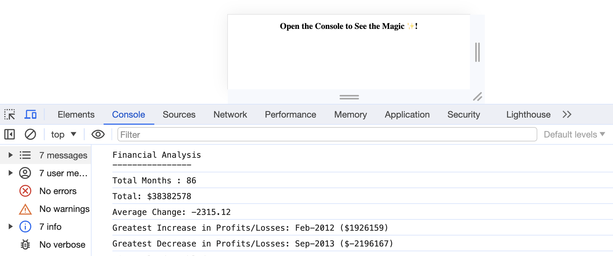

# Console-Finances
Repository for Module 4 challenge, analysing a fictional company's financial records.

# Module 4 challenge: calculate financial data given an array of profits/losses per month over a set period

This repository was created for the fourth challenge of the EdX Front End Web Development bootcamp to practise working with arrays and Math functions of Javascript. The raw data (date and dollar amount pairs) needed to be manipulated to calculate typical types of company financial overview data and present it in a given format in the console. 

## Description

Learning to work with arrays is a key skill of a front end web developer. Javascript has many inbuilt functions and methods, but thinking laterally about which to apply and when is something that needs to be frequently practised. Coding real-word style examples like this challenge helps keep one up to date with the latest code, while referring to code repositories with similar examples can provide useful information that can be applied in future. There can be many solutions to a given problem and it's a helpful learning experience to compare and pool ideas or refer to other coders' approaches.

## Installation

N/A

## Usage

https://github.com/SpecialFriendRice/Console-Finances

https://specialfriendrice.github.io/Console-Finances/

## Credits

Referred to own notes from course, Xpert Learning Assistant for syntax queries and StackOverflow/W3Schools for background reading about array properties, methods and functions. No code has been copied.

## License

MIT Licence, as outlined in the Github repository.
